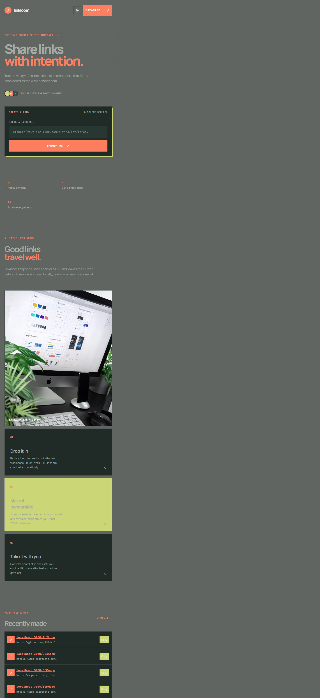
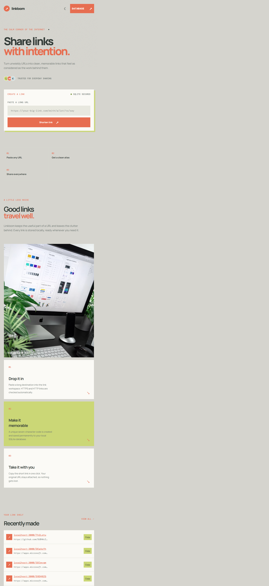
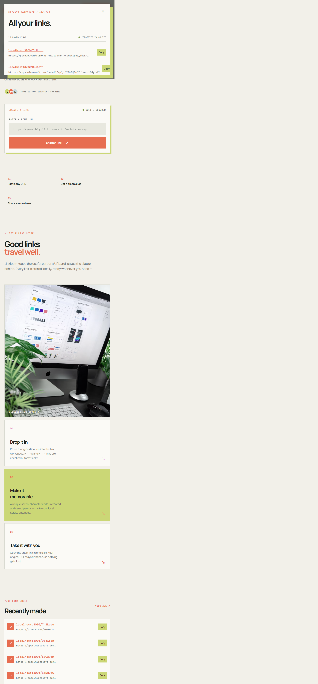
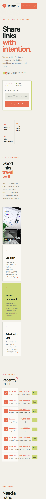

# Linkloom

<div align="center">
	
	<br>
	<br>
	<a href="https://github.com/SUBHAJIT-mallickbnj/CodeAlpha_Task-1"></a>
	
	
</div>

> A focused, SQLite-backed URL shortener for turning long destinations into clean, memorable links.

## What it does

Linkloom accepts a valid `http://` or `https://` URL, creates a unique seven-character alias, stores the mapping locally, and redirects visitors to the original destination. The interface also includes a recent-link shelf, one-click copying, click counts, a light/dark theme switch, and an authenticated archive view.

## Preview

<div align="center">
	
	<br><br>
	
</div>

<details>
	<summary><strong>More interface views</strong></summary>
	<br>
	<p align="center"><strong>SQLite archive</strong></p>
	
	<br><br>
	<p align="center"><strong>Responsive mobile layout</strong></p>
	
</details>

## Technology stack

| Technology | Why it is used | Official link |
| --- | --- | --- |
| [Node.js](https://nodejs.org/en/download) | JavaScript runtime for the server | [Download Node.js](https://nodejs.org/en/download) |
| [Express.js](https://expressjs.com/) | HTTP server, static files, and API routes | [Express documentation](https://expressjs.com/) |
| [SQLite](https://www.sqlite.org/download.html) | Lightweight local persistence for links and click counts | [Download SQLite](https://www.sqlite.org/download.html) |
| [sqlite3](https://www.npmjs.com/package/sqlite3) | Node.js driver used to access SQLite | [npm package](https://www.npmjs.com/package/sqlite3) |
| [Nanoid](https://github.com/ai/nanoid) | Generates compact, collision-resistant short codes | [Nanoid documentation](https://github.com/ai/nanoid) |
| [Vanilla JavaScript](https://developer.mozilla.org/en-US/docs/Web/JavaScript) | Browser interactions without a frontend framework | [MDN JavaScript guide](https://developer.mozilla.org/en-US/docs/Web/JavaScript) |
| [HTML5](https://developer.mozilla.org/en-US/docs/Web/HTML) and [CSS3](https://developer.mozilla.org/en-US/docs/Web/CSS) | Accessible structure and responsive visual design | [MDN web docs](https://developer.mozilla.org/en-US/docs/Web) |

## Run it locally

### Prerequisites

- Install [Node.js LTS](https://nodejs.org/en/download), which includes `npm`.
- Use a terminal inside this project folder.

### Install and start

```bash
npm install
npm start
```

Open [http://localhost:3000](http://localhost:3000) in your browser. For automatic restarts while developing, run:

```bash
npm run dev
```

The first launch creates `links.db` beside `server.js`. That local database is intentionally ignored by Git so personal links are not uploaded.

## How to use it

1. Paste a complete URL into **Paste a long URL**.
2. Select **Shorten link**.
3. Copy the generated short URL or open it to test the redirect.
4. Review recent links and click counts in **Recently made**.
5. Select **Database**, then use the local demo credentials below to open the full archive.
6. Use the moon/sun button to switch between light and dark themes.

### Archive demo login

This is a local learning-project gate, not production authentication.

```text
Username: linkroom
Password: linkroom@123
```

## Request flow

```text
Browser -> POST /api/shorten -> Validate URL -> Create 7-character code
																			|
																			v
															 Save in SQLite
																			|
																			v
Browser <- short URL -------- JSON response

Visitor -> GET /:code -> Find stored destination -> Increment clicks -> 302 redirect
```

## API reference

| Method | Route | Purpose |
| --- | --- | --- |
| `POST` | `/api/shorten` | Validates and stores `{ "url": "https://example.com" }`, then returns the short link |
| `GET` | `/api/links` | Returns saved links with aliases, destinations, timestamps, and click counts |
| `GET` | `/:code` | Redirects to the original URL and increments its click count |
| `GET` | `/api/health` | Returns `{ "status": "ok", "database": "connected" }` when the app is healthy |

Example API request:

```bash
curl -X POST http://localhost:3000/api/shorten \
	-H "Content-Type: application/json" \
	-d '{"url":"https://example.com"}'
```

## Project structure

```text
.
├── public/
│   ├── 404.html       # Friendly missing-link page
│   ├── app.js         # Form, archive, theme, and copy interactions
│   ├── index.html     # Linkloom interface
│   └── styles.css     # Responsive light/dark visual system
├── docs/screenshots/  # README previews captured from the running app
├── docs/linkloom-banner.svg
├── server.js          # Express routes and SQLite persistence
├── package.json       # Scripts and dependencies
└── links.db           # Local runtime database, ignored by Git
```

## Verification

The application was checked locally with the following flow:

- `GET /api/health` returned a connected SQLite status.
- `POST /api/shorten` created a unique short code.
- `GET /:code` returned a redirect to the saved destination.
- The light theme, dark theme, mobile layout, archive login, and screenshots were verified in a browser.

## Repository

Source: [github.com/SUBHAJIT-mallickbnj/CodeAlpha_Task-1](https://github.com/SUBHAJIT-mallickbnj/CodeAlpha_Task-1)